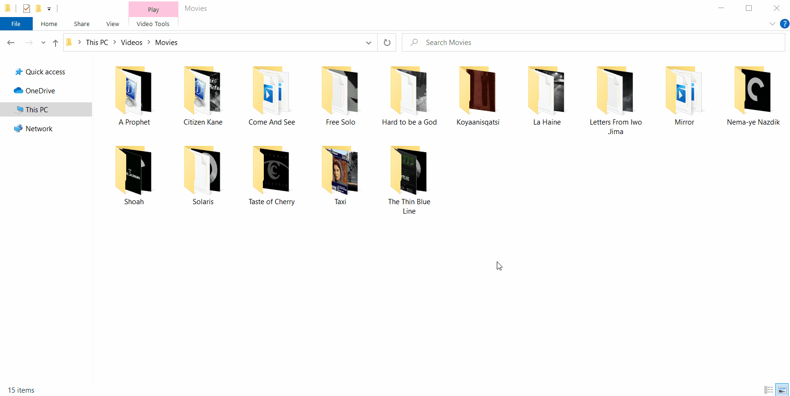

# Movie-Selector 

Couldn't decide what movie to watch, so created this little app. Randomly selects a file in the current directory and opens it up, so I don't have to make the hard decision of choosing.

key-maker.py needs to be run first in order to create Windows registry keys for application. Once reg keys are created, the movie selector script will appear in the right-click context menu. Enter folder with movies, right-click and select Movie Selector, and one the folders will be opened randomly.
